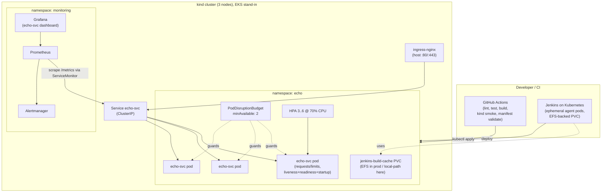

# Architecture

## What this is

A local-cluster (`kind`) reconstruction of a real EKS reliability incident,
wired with the CI/CD and observability that would have prevented it. It runs on
a Mac mini with no cloud cost, but every piece is shaped so it would lift onto
EKS with minimal change.

## Component diagram



## Request / data flow

1. Traffic enters via **ingress-nginx** (kind maps host ports 80/443 to it) →
   `echo-svc` **Service** (ClusterIP) → only **ready** pods (readiness probe
   gates Service endpoints).
2. Each pod serves `/`, `/health` (liveness), `/ready` (readiness), `/metrics`.
3. **Prometheus** scrapes `/metrics` every 15s via the **ServiceMonitor**.
   **PrometheusRule** alerts evaluate restart storms / OOMKills / readiness 503s
   / node memory pressure / replica floor and route to **Alertmanager**.
   **Grafana** reads Prometheus and renders the echo-svc dashboard.
4. **HPA** scales 3→6 on CPU (possible only because pods now have requests).
   **PDB** keeps ≥2 ready during voluntary disruptions.
5. **CI**: GitHub Actions on every push/PR (lint→test→build→kind smoke→manifest
   validate). **Jenkins** models the on-cluster rebuild: ephemeral agent pods +
   an EFS-backed PVC for the build cache.

## ASCII fallback (if mermaid doesn't render)

```
 GitHub Actions ─┐                         ┌── Grafana ── Prometheus ──┐
 Jenkins/k8s  ───┼─ kubectl apply ─▶ echo ns│        ▲ scrape /metrics  │
   (EFS PVC)     │                   ┌───────┴──────────────────────┐   │
                 │   ingress-nginx ─▶│ Service ─▶ pod x3             │   │
                 │   (:80/:443)      │   ▲HPA  ▲PDB(min2)  startup/  │   │
                 │                   │         live/ready probes     │   │
                 └───────────────────┴───────────────────────────────┘  │
                                          alerts ─▶ Alertmanager ────────┘
```

## Key design decisions (and why)

| Decision | Why |
|---|---|
| `kind`, not minikube | Multi-node out of the box → PDB / topology spread / drains are real. Closest local analog to EKS. |
| FastAPI echo service | Small, real, exposes the `/health` vs `/ready` split that caused the incident. |
| Separate good/bad manifests | The post-mortem references a runnable diff, not prose. |
| kube-prometheus-stack | One Helm install gives Prometheus+Grafana+Alertmanager+CRDs; same chart works on EKS. |
| Terraform targets local kind | Infra-as-code discipline without cloud spend; swap `kind_cluster` for the EKS module to go live. |
| Ansible for bootstrap | Prereqs + cluster + stack reproducible from one command; mirrors how I keep environments consistent. |
| EFS modeled as a PVC | Honest about the prod→demo mapping: only the StorageClass differs. |

## Prod (EKS) deltas

- `terraform/main.tf`: `kind_cluster` → `terraform-aws-modules/eks`; providers
  otherwise identical.
- `ci/jenkins-pvc.yaml`: `standard`/RWO → `efs-sc`/RWX (EFS CSI driver).
- Image: `echo-svc:local` (kind-loaded) → ECR image ref.
- Ingress: nginx → AWS Load Balancer Controller (ALB) if desired.
